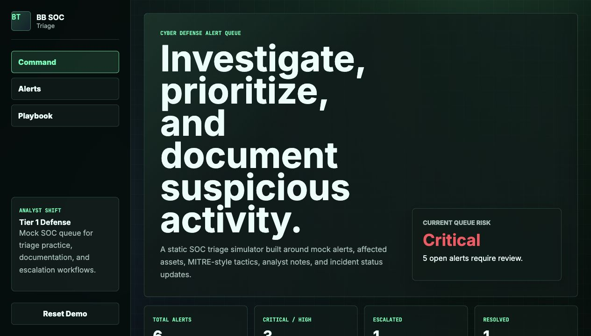
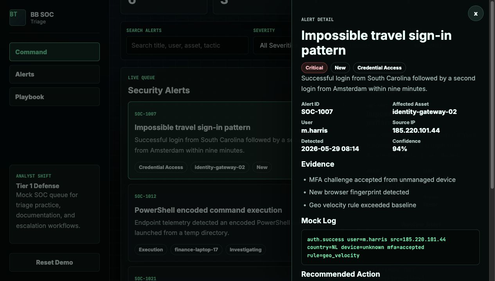

# BB SOC Triage

BB SOC Triage is a mock cyber defense alert triage dashboard built for portfolio use. It models the kind of first-pass investigation workflow a Tier 1 analyst might use when reviewing suspicious activity, documenting notes, and deciding whether an alert needs escalation.

I built this project to connect my software engineering background with my interest in cyber defense, incident response, and infrastructure support. The app is intentionally lightweight and GitHub Pages-friendly, but the workflow is practical: review the signal, check the affected asset and user, read the mock log, document findings, and move the alert through a clear status.

Live demo: https://briannab1997.github.io/BB-SOC-Triage/

## Screenshots





## What It Does

- Displays a mock SOC/SIEM-style alert queue.
- Tracks alert severity, status, confidence, affected assets, users, source IPs, and MITRE-style tactics.
- Sorts alerts by priority so critical and high-risk items rise to the top.
- Filters alerts by search, severity, status, and tactic.
- Opens a detail drawer with evidence, mock logs, recommended actions, and analyst notes.
- Saves status changes and notes in browser local storage.
- Includes a small triage playbook section for documentation and escalation habits.
- Includes tests for filtering, sorting, metrics, status updates, and seeded data.

## Why This Project

BB SOC Triage is not a real security tool, but it demonstrates practical security operations thinking through a focused, entry-level-friendly workflow:

- triaging information quickly
- prioritizing risk
- documenting technical findings
- understanding affected users and assets
- escalating when the evidence supports it
- validating logic with tests

## Tech Stack

- HTML5
- CSS3
- Vanilla JavaScript
- Browser localStorage
- Node.js test runner

## Run Locally

```bash
npm start
```

Then open:

```text
http://localhost:8000
```

## Test

```bash
npm test
```

## Project Structure

```text
.
├── css/
│   └── style.css
├── js/
│   ├── app.js
│   ├── data.js
│   └── triageService.js
├── tests/
│   └── triageService.test.js
├── index.html
├── package.json
└── README.md
```

## Portfolio Summary

BB SOC Triage is a mock cyber defense alert dashboard for reviewing security alerts, prioritizing severity, mapping suspicious activity to tactics, documenting analyst notes, and moving incidents through investigation, escalation, and resolution workflows.
